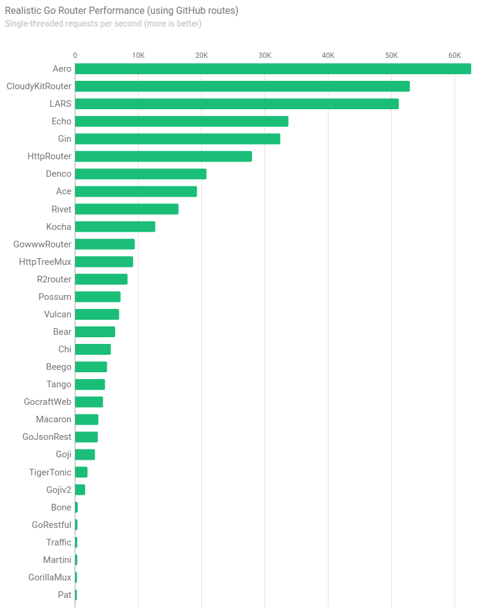

[![Godoc][godoc-image]][godoc-url]
[![Report][report-image]][report-url]
[![Tests][tests-image]][tests-url]
[![Coverage][coverage-image]][coverage-url]
[![Sponsor][sponsor-image]][sponsor-url]

Aero is a high-performance web server with a clean API.

## Installation

```shell
go get -u github.com/aerogo/aero/...
```

## Benchmarks

[](docs/Benchmarks.md)

## Features

- HTTP/2
- Radix tree routing
- Low latency
- Bandwidth savings via automated ETags
- Session data with custom stores
- Server-sent events
- Context interface for custom contexts

## Links

- [API](docs/API.md)
- [Configuration](docs/Configuration.md)
- [Benchmarks](docs/Benchmarks.md)

[godoc-image]: https://godoc.org/github.com/aerogo/aero?status.svg
[godoc-url]: https://godoc.org/github.com/aerogo/aero
[report-image]: https://goreportcard.com/badge/github.com/aerogo/aero
[report-url]: https://goreportcard.com/report/github.com/aerogo/aero
[tests-image]: https://cloud.drone.io/api/badges/aerogo/aero/status.svg
[tests-url]: https://cloud.drone.io/aerogo/aero
[coverage-image]: https://codecov.io/gh/aerogo/aero/graph/badge.svg
[coverage-url]: https://codecov.io/gh/aerogo/aero
[sponsor-image]: https://img.shields.io/badge/github-donate-green.svg
[sponsor-url]: https://github.com/users/akyoto/sponsorship
